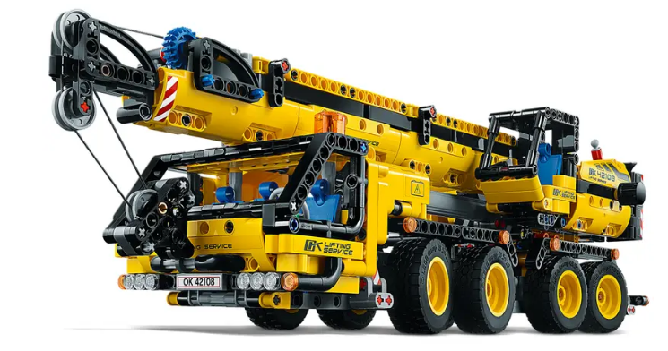

# Python and the LEGO 42108 crane

Welcome to a journey into the world of LEGO and programming!
My son has an incredible knack for building complex LEGO models far ahead of his years but doesn't do programming yet.
As his passion for LEGO grew, I couldn't help but wonder how to foster his curiosity and help him delve into
the captivating realm of programming.
Consequently, I embarked on a mission to combine his beloved LEGO 42108 Crane set with our vintage NXT controller and motors.



In this guide, we'll be exploring a creative and educational fusion of physical engineering and computer programming.
This adaptation transforms the manually-operated handles of the LEGO crane into motor-powered components.
The fun doesn't stop here, though!
With the help of Python, the crane can be controlled using your keyboard,
presenting a small interface for young budding programmers.

## Usage

You'll need Python >= 3.10. Install the dependencies from the `requirements.txt` file

```shell
pip install -r requirements.txt
```