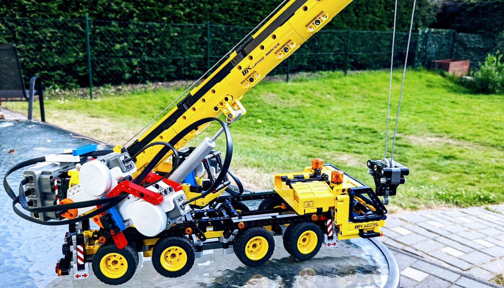
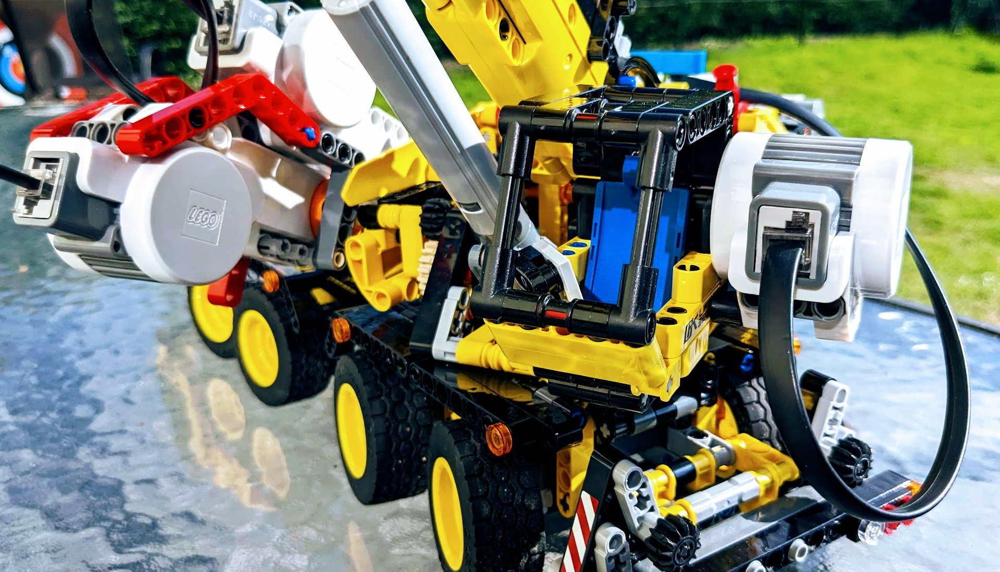
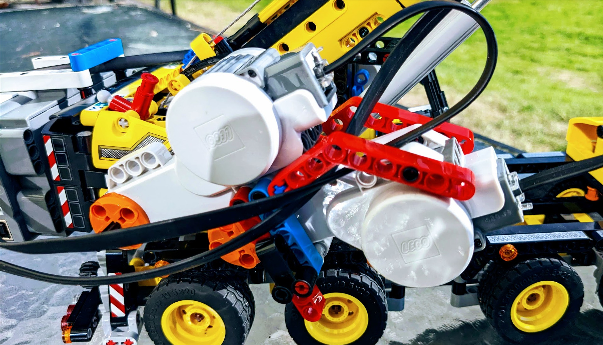
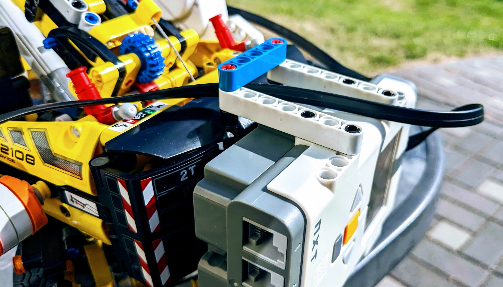

# Python and the LEGO 42108 Crane

Welcome to a journey into the world of LEGO and programming!
My son has an incredible knack for building complex LEGO models far ahead of his years but doesn't do programming yet.
I always wondered how to foster his curiosity and help him delve into the captivating realm of programming.
Or at least to get him interested in what I do all the time when I work.
So my thinking was to start off with simply combining one of his existing sets, the LEGO 42108 Crane, with our vintage 
LEGO NXT controller and motors.


Here, you'll find how you can transform the manually-operated handles of the LEGO crane into motor-powered components.
With the help of the Python code, the crane can be controlled using your keyboard. I'm using the pygame package to
display a small interface and capture key presses.

## Construction

Putting the motor and the NXT controller was fairly simple, and I was not really allowed to take part in it.
I took some pictures, but basically it's just these steps:

1. Two motors go on the right side. We attached them to each other so that we don't need to attach them to the crane
   to counter the rotation force.
2. One motor goes on the left side and is actually attached to the crane. I'm not sure how that was done as I was busy
   hacking the Python code, but it shouldn't be too hard.
3. The NXT controller fits neatly on the two studs on top of the crane's back.
4. We connected the two motors on the right to ports `A` and `B` and 
   the motor on the right to port `C`.

I attach some images for reference.








## Code Usage

You'll need Python >= 3.10. Install the dependencies from the `requirements.txt` file

```shell
pip install -r requirements.txt
```

If you run into USB connection issues on Linux, please consult [the FAQ](https://github.com/pyusb/pyusb/blob/master/docs/faq.rst#how-to-practically-deal-with-permission-issues-on-linux) of the `pyusb` package.

Other than that it's just starting the program with `python3 main.py`.
The code is currently completely undocumented and not revised by any means.
Also, if you ever prepare for a coding interview and want to bring your abilities to the
next level, just put a kid behind you who asks every minute "aren't you done yet?"